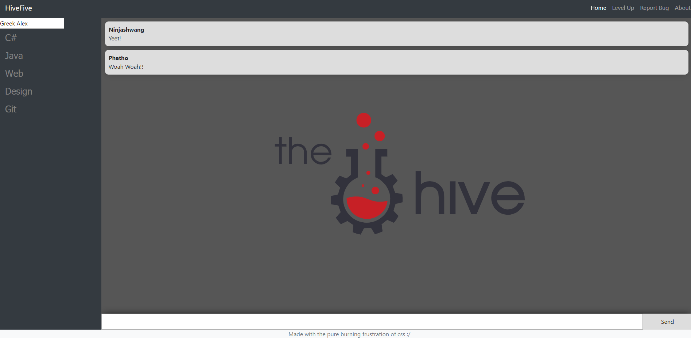

# HiveFive
Application for asking questions and getting help with your continuous learning on The Hive

## Back-End
All these commands should be run within the 'hive-five-server' folder
### Set-Up
`npm install`

### Run
`node src/index.js`

## Front-End

All these commands should be run within the 'hive-five-app' folder
### Set-Up
`npm install`

### Run
`ng serve -o`